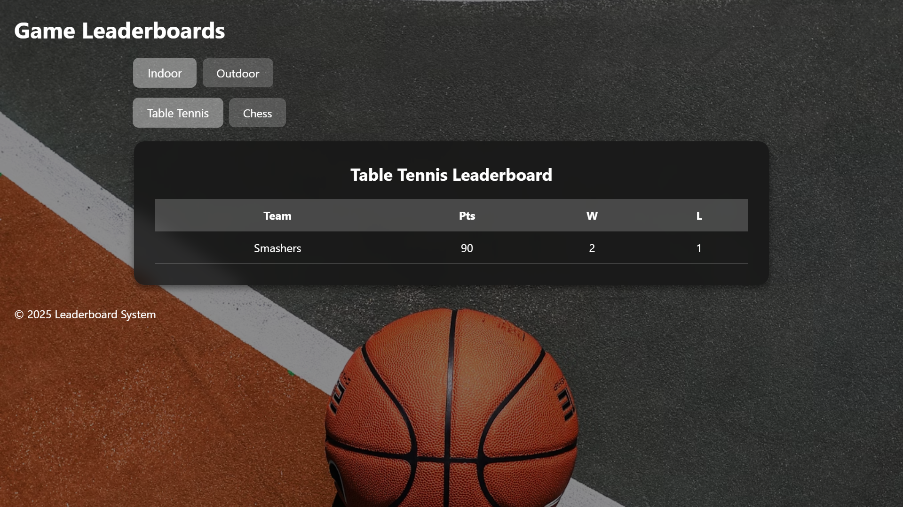

# College Website

A web platform for students to share memories, stay updated on events, and track sports scores. It includes user authentication, media sharing, a leaderboard, and an admin panel for management.

## Features
- **User Authentication**: Login via email and OTP verification.
- **Image Sharing**: Upload and share college memories.
- **Social Follow Page**: Connect with other students.
- **Gallery**: View and manage images.
- **Upcoming Events**: Stay informed about college events.
- **Video Viewing**: Watch uploaded videos.
- **Leaderboard**: Track sports scores and rankings.
- **Admin Panel**: Manage teams, games, categories, and update scores.

## Tech Stack
- **Backend**: Django
- **Database**: PostgreSQL (using Supabase)
- **Frontend**: HTML, CSS, JavaScript
- **Hosting**: Vercel (or alternative)

## Installation
1. Clone the repository:
   ```sh
   git clone https://github.com/dev9310/College-Website.git
   cd college-website
   ```

2. Create a virtual environment and activate it:
   ```sh
   python -m venv env
   source env/bin/activate  # On Windows use `env\Scripts\activate`
   ```

3. Install dependencies:
   ```sh
   pip install -r requirements.txt
   ```

4. Set up environment variables:
   Create a `.env` file in the root directory and add the required credentials.

5. Apply migrations:
   ```sh
   python manage.py migrate
   ```

6. Create a superuser:
   ```sh
   python manage.py createsuperuser
   ```

7. Collect static files:
   ```sh
   python manage.py collectstatic
   ```

8. Run the development server:
   ```sh
   python manage.py runserver
   ```

## Usage
- **Admin Panel**: Access at `http://127.0.0.1:8000/admin/` to manage events, categories, games, and teams.
- **Gallery**: View images at `http://127.0.0.1:8000/gallery/`.
- **Leaderboard**: Check rankings at `http://127.0.0.1:8000/leaderboard/`.

## Screenshots

### Login Page


### Home Page


### Social


### Leaderboard


## Deployment
To deploy this project on Vercel:
1. Create a `vercel.json` file in the root directory.
2. Configure environment variables in Vercel.
3. Deploy using the Vercel CLI:
   ```sh
   vercel
   ```

## License
This project is licensed under the MIT License. See the LICENSE file for details.

